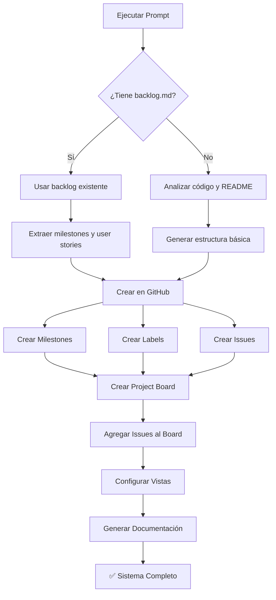

# 🚀 Template Universal: GitHub Project Management Setup

## 📋 Prompt Template (Copiar y Pegar)

```
Configura un sistema completo de gestión de proyecto en GitHub para mi
repositorio siguiendo esta metodología:

## 🔍 FASE 1: ANÁLISIS DEL PROYECTO

Primero, analiza mi proyecto y determina:

1. **Estado del repositorio:**
   - ¿Es un proyecto nuevo o existente?
   - ¿Tiene documentación de planificación? (backlog.md, roadmap.md, etc.)
   - ¿Ya tiene issues/milestones creados?
   - ¿Tiene un README con roadmap o features?

2. **Identifica información existente en:**
   - `/docs/**/*.md` (backlog, roadmap, PRD, user stories)
   - `README.md` (features, milestones, tasks)
   - `CHANGELOG.md` o commits recientes
   - Issues y PRs existentes
   - Comentarios del código (TODOs, FIXMEs)

3. **Extrae estructura del proyecto:**
   - Milestones/Fases del proyecto
   - Épicas o módulos principales
   - User Stories o tareas
   - Prioridades y dependencias
   - Estado actual de cada componente

## 🎯 FASE 2: GENERACIÓN (solo si no existe)

Si NO encuentras documentación de planificación estructurada:

1. **Genera un backlog básico** basándote en:
   - Estructura de carpetas del código
   - README y descripción del proyecto
   - TODOs en el código
   - Issues/PRs existentes
   - Commits recientes

2. **Crea estructura mínima:**
   - 3-5 milestones lógicos según el ciclo del proyecto
   - Agrupa funcionalidades en épicas
   - Lista tareas principales como user stories
   - Asigna prioridades (P0/P1/P2)

3. **Guarda esta estructura** en `docs/backlog.md` para futuras referencias

## ⚙️ FASE 3: IMPLEMENTACIÓN EN GITHUB

Con la información recopilada o generada:

1. **Milestones:**
   - Crea milestones en GitHub con descripciones claras
   - Si hay trabajo completado, crea milestone cerrado con issues retrospectivos
   - Incluye milestones futuros abiertos

2. **Labels:**
   - Prioridad: P0:Crítica, P1:Alta, P2:Media
   - Épicas: Epic:NombreÉpica
   - Story Points: story-points:N
   - Estado: status:in-progress, status:completed
   - (Agregar labels custom del proyecto si aplica)

3. **Issues:**
   - Crea issues desde user stories/tareas identificadas
   - Incluye: título, descripción, criterios de aceptación, labels
   - Asigna a milestone correcto
   - Si ya está hecho: crea issue y ciérralo inmediatamente
   - Marca dependencias entre issues

4. **GitHub Project Board:**
   - Crea project board tipo Kanban
   - Columnas: Backlog, To Do, In Progress, Review, Done
   - Agrega TODOS los issues (abiertos y cerrados)
   - Configura vistas múltiples:
     * Vista principal: por estado
     * Vista por milestone
     * Vista por épica/módulo
     * Vista por prioridad

5. **Automatizaciones:**
   - Auto-add issues al proyecto
   - Auto-move cuando se cierra/reabre
   - Configurar workflows básicos

## 📦 FASE 4: ENTREGABLES

Provee:

1. **Scripts ejecutables:**
   - Script para crear milestones
   - Script para crear labels
   - Script para crear issues
   - Script para agregar issues al project
   - Manejo de errores y permisos

2. **Documentación generada:**
   - `docs/backlog.md` (si no existía)
   - `docs/project-board-setup.md` (instrucciones)
   - `scripts/setup-github-project.sh` (script all-in-one)
   - Actualizar README con links al project board

3. **Resumen de lo creado:**
   - Número de milestones, issues, labels
   - Link al project board
   - Estadísticas (% completado, issues por prioridad)
   - Próximos pasos recomendados

## 🎨 PERSONALIZACIÓN (Opcional)

Si encuentras estos patrones, úsalos:
- Sprint planning → Crear milestones por sprint
- Metodología ágil → Agregar campos de story points
- Múltiples repos → Usar org-level project
- CI/CD definido → Relacionar con deployment milestones

## ⚠️ CONSIDERACIONES TÉCNICAS

- Si `gh CLI` no tiene permisos de project: provee pasos manuales
- Si hay muchos issues (>50): ofrece crear en lotes
- Si el repo es privado: ajusta visibilidad del project
- Verifica autenticación antes de ejecutar scripts

## 📊 INFORMACIÓN ADICIONAL

**Repositorio:** [URL o nombre]
**Estado del proyecto:** [Nuevo/En desarrollo/En producción/Mantenimiento]
**Tiene backlog existente:** [Sí/No/Parcial]
**Metodología preferida:** [Ágil/Kanban/Scrum/Waterfall/Otra]
**Equipo:** [Solo yo / 2-5 personas / 5+ personas]
**Prioridad:** [Speed/Completeness/Documentation]

---

## 🎯 OBJETIVO FINAL

Tener un sistema completo de gestión visible en:
- Milestones: https://github.com/[OWNER]/[REPO]/milestones
- Issues: https://github.com/[OWNER]/[REPO]/issues
- Project Board: https://github.com/users/[OWNER]/projects/[N]

Similar a este ejemplo: [ADJUNTAR SCREENSHOT SI TIENES]
```

---

## 📝 Cómo Usar Este Template

### Para Proyecto Nuevo (desde cero):

```
[Pega el template de arriba]

**Información adicional:**
Repositorio: https://github.com/usuario/mi-nuevo-proyecto
Estado del proyecto: Nuevo (solo tengo README básico)
Tiene backlog existente: No
Metodología preferida: Ágil con sprints de 2 semanas
Equipo: Solo yo
Prioridad: Speed (quiero empezar rápido)
```

### Para Proyecto Existente (como Florece):

```
[Pega el template de arriba]

**Información adicional:**
Repositorio: https://github.com/wolfcito/florece
Estado del proyecto: En desarrollo (MVP en progreso)
Tiene backlog existente: Sí (docs/backlog.md muy completo)
Metodología preferida: Kanban con milestones
Equipo: 2-3 desarrolladores
Prioridad: Completeness (quiero todo bien organizado)

**Adjunto:** [Imagen del panel de milestones que quiero replicar]
```

### Para Proyecto en Producción:

```
[Pega el template de arriba]

**Información adicional:**
Repositorio: https://github.com/company/production-app
Estado del proyecto: En producción (v2.3.4)
Tiene backlog existente: Parcial (solo features en GitHub Projects viejo)
Metodología preferida: Scrum con releases cada 3 semanas
Equipo: 8 personas (3 equipos)
Prioridad: Documentation (necesito migrar de otro sistema)
```

---

## 🎯 Variables a Personalizar

Reemplaza estos placeholders con tu información:

| Variable | Descripción | Ejemplo |
|----------|-------------|---------|
| `[OWNER]` | Tu usuario/org de GitHub | `wolfcito` |
| `[REPO]` | Nombre del repositorio | `florece` |
| `[N]` | Número del project (después de crearlo) | `2` |
| `[URL]` | URL completa del repo | `https://github.com/wolfcito/florece` |
| `[ESTADO]` | Nuevo/Desarrollo/Producción | `En desarrollo` |

---

## 🔄 Flujo de Trabajo del Template



---

## 💡 Ejemplos de Respuesta Esperada

### Si encuentra backlog existente:
```
✅ Encontré documentación en docs/backlog.md

Estructura detectada:
- 4 Milestones (M0-M3)
- 7 Épicas (E1-E7)
- 32 User Stories
- Estado: M0 completado, M1 en progreso

Procediendo a crear en GitHub...
[Scripts y comandos]
```

### Si NO encuentra backlog:
```
❌ No encontré backlog estructurado

Analicé el proyecto y propongo:

📦 Milestones sugeridos:
1. Setup & Foundation (completado según commits)
2. Core Features (en progreso según TODOs)
3. Testing & Polish (pendiente)
4. Production Ready (pendiente)

🎯 Épicas identificadas desde código:
- Auth System (src/auth/)
- API Endpoints (src/api/)
- Database Layer (src/db/)

¿Procedo con esta estructura? [Sí/No/Modificar]
```

---

## 🚀 Quick Start (TL;DR)

**Para usar en cualquier proyecto en 30 segundos:**

1. Copia el template principal
2. Pega en tu conversación con el AI agent
3. Rellena solo estas 3 líneas:
   ```
   Repositorio: https://github.com/OWNER/REPO
   Estado: [Nuevo/Desarrollo/Producción]
   Tiene backlog: [Sí/No]
   ```
4. Ejecuta los scripts que te dé

**Eso es todo.** El template se encarga del resto.

---

## 📚 Archivos Complementarios

Este template genera automáticamente:

- ✅ `docs/backlog.md` - Si no existe
- ✅ `docs/project-board-setup.md` - Instrucciones
- ✅ `scripts/setup-github-project.sh` - Script todo-en-uno
- ✅ `scripts/add-issues-to-project.sh` - Agregar issues
- ✅ `.github/project-config.json` - Configuración del project

---

## 🎓 Casos de Uso

### ✅ Caso 1: Proyecto Personal Nuevo
*"Acabo de crear un repo y quiero organizarme desde el día 1"*

→ El template analiza tu README, genera backlog básico, crea 3-4 milestones simples.

### ✅ Caso 2: Proyecto de Equipo con Docs
*"Tenemos PRD y roadmap pero nada en GitHub Projects"*

→ El template lee tus docs, extrae épicas y features, crea estructura completa.

### ✅ Caso 3: Migración desde Otra Herramienta
*"Venimos de Jira/Trello y queremos GitHub Projects"*

→ El template analiza issues existentes, preserva estado, organiza todo.

### ✅ Caso 4: Proyecto Legacy
*"Código viejo sin documentación de planning"*

→ El template analiza código, commits, PRs, genera retroactivamente la estructura.

---

## 🔧 Troubleshooting Integrado

El template maneja automáticamente:

- ❌ Sin permisos de `gh CLI` → Da pasos manuales
- ❌ Repo privado → Ajusta visibilidad
- ❌ Muchos issues → Crea en batches
- ❌ Milestones duplicados → Los detecta y reutiliza
- ❌ Sin backlog → Lo genera inteligentemente

---

## 📈 Resultado Final Esperado

Después de usar el template tendrás:

```
Tu Repositorio
├── 🎯 Milestones configurados (X cerrados, Y abiertos)
├── 🏷️ Labels organizadas (prioridad, épica, puntos)
├── 📝 Issues creados (todos con metadata completa)
├── 📊 Project Board funcional
│   ├── Vista: Por Estado
│   ├── Vista: Por Milestone
│   ├── Vista: Por Épica
│   └── Vista: Por Prioridad
├── 📚 Documentación actualizada
│   ├── docs/backlog.md
│   └── docs/project-board-setup.md
└── 🤖 Scripts para mantenimiento
    ├── scripts/setup-github-project.sh
    └── scripts/add-issues-to-project.sh
```

---

**Versión:** 1.0.0
**Última actualización:** 2026-02-06
**Proyecto de ejemplo:** [Florece](https://github.com/wolfcito/florece)
**Project Board ejemplo:** https://github.com/users/wolfcito/projects/2

---

## 💾 Guardar para Uso Futuro

1. **Guarda este archivo** en tu repo de templates
2. **Favoritos del navegador**: Bookmark este archivo en GitHub
3. **Snippet manager**: Guarda el prompt en tu snippet tool
4. **Notion/Obsidian**: Copia a tu knowledge base

**Cada vez que inicies un proyecto, solo pégalo y ajusta 3 variables.**
